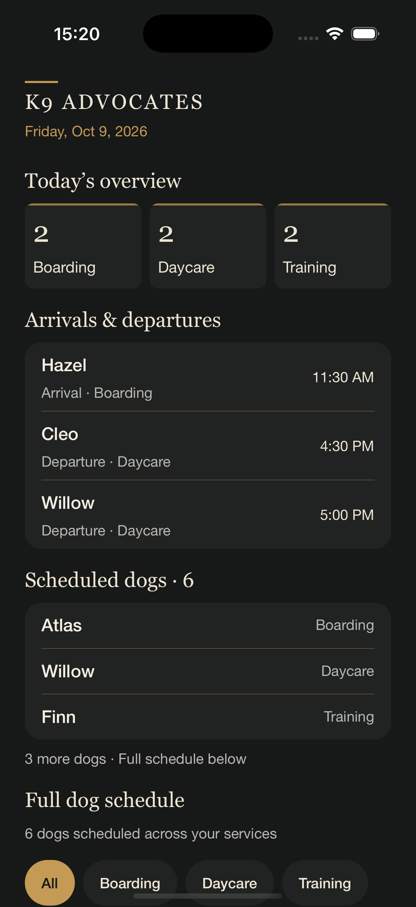

# K9 Advocates Mobile

An internal iPhone app for **K9 Advocates LLC**, a dog training, boarding, and daycare business. The app is designed for the business's administrators and is being developed as a public software development and QA portfolio project.

> **Project status: Early development (v0.1).** Project planning began on October 9, 2026. The Expo project has been initialized, and a dashboard prototype using fictional sample data runs in the iOS Simulator. It is not yet connected to a backend or real data. All other features below are planned.

## App Preview

<p align="center">
  
</p>

<p align="center"><em>The v0.1 dashboard prototype on the iPhone 16 Pro simulator. All client and dog data shown is fictional sample data.</em></p>

## Technology

| Area | Selection | Status |
|---|---|---|
| Framework | React Native | Selected |
| Toolchain | Expo | Selected (SDK 57) |
| Language | TypeScript | Selected |
| Backend architecture | — | Not yet decided |
| Cloud database | — | Not yet decided |
| Authentication service | — | Not yet decided |

## Planned Features

| Feature | Status |
|---|---|
| Administrator authentication | PLANNED |
| Business dashboard | IN PROGRESS (v0.1 prototype with sample data) |
| Client and dog profiles | PLANNED |
| Booking calendar | PLANNED |
| Boarding, daycare, and training management | PLANNED |
| Payments and tips | PLANNED |
| Website inquiry management | PLANNED |
| Synchronization with the K9 Advocates desktop Hub | PLANNED (future) |
| Apple Calendar integration | PLANNED (future) |
| Quo integration | Possible future feature (not in initial MVP) |
| Customer portal | Possible later phase |

The existing K9 Advocates desktop Hub (Python/Streamlit with SQLite) is a separate project. Any future connection to it would go through a secure backend.

## Design Direction

The app will follow the existing K9 Advocates brand identity: warm cream, charcoal, and muted gold tones, elegant typography, and German Shepherd imagery, presented through native iPhone navigation and mobile-friendly layouts.

## Setup

Running the app on the iOS Simulator requires a Mac with Xcode installed, plus Node.js and npm.

```bash
git clone https://github.com/lalacbr11/k9-advocates-mobile.git
cd k9-advocates-mobile
npm install
npm run ios
```

`npm run ios` starts the Expo development server and opens the app in the iOS Simulator using Expo Go.

## Screenshots

See [App Preview](#app-preview) for the v0.1 dashboard prototype. More screenshots will be added as features are implemented.

## Development Approach

This project is developed and maintained by **Laura Neugebauer**, using AI-assisted development and documentation.

AI tools support planning, coding, troubleshooting, and QA documentation. Laura directs the project, makes development decisions, and reviews and verifies the work.

## Data and Privacy

This repository is public. It does not contain, and must never contain, real customer information, production databases, credentials, API keys, or other secrets. All examples and test data are fictional.

## Documentation

- [CHANGELOG.md](CHANGELOG.md): notable changes and milestones
- [docs/DEVELOPMENT_LOG.md](docs/DEVELOPMENT_LOG.md): development history and technical decisions

## License and Brand Ownership

No software license has been granted. K9 Advocates LLC retains its rights to the business name, logo, and original branded assets. Third-party images and other materials remain subject to their respective licenses.
